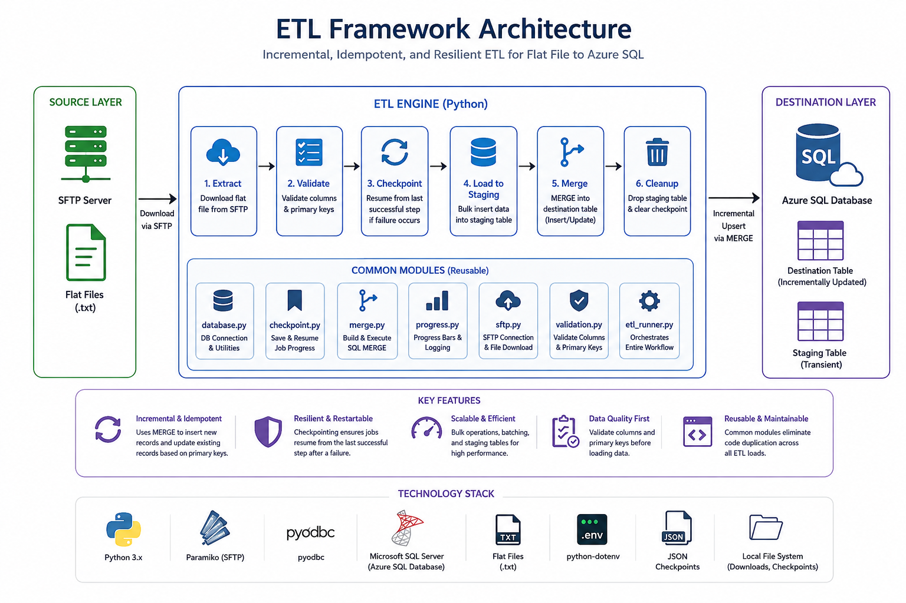
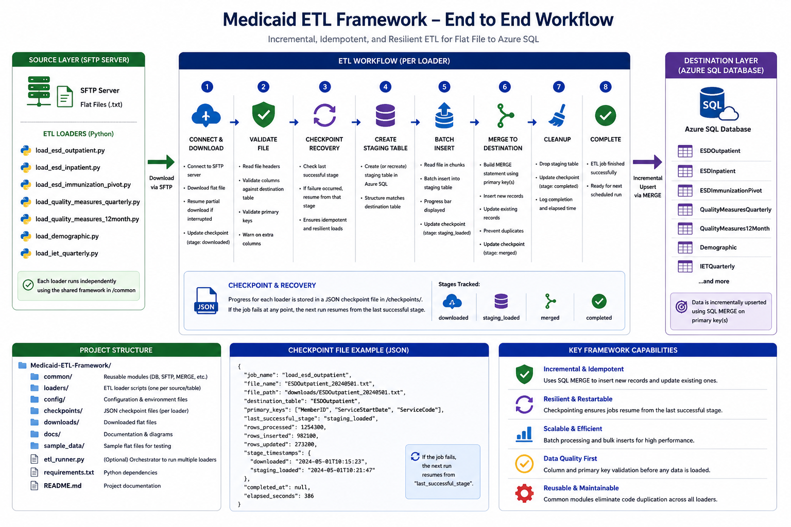
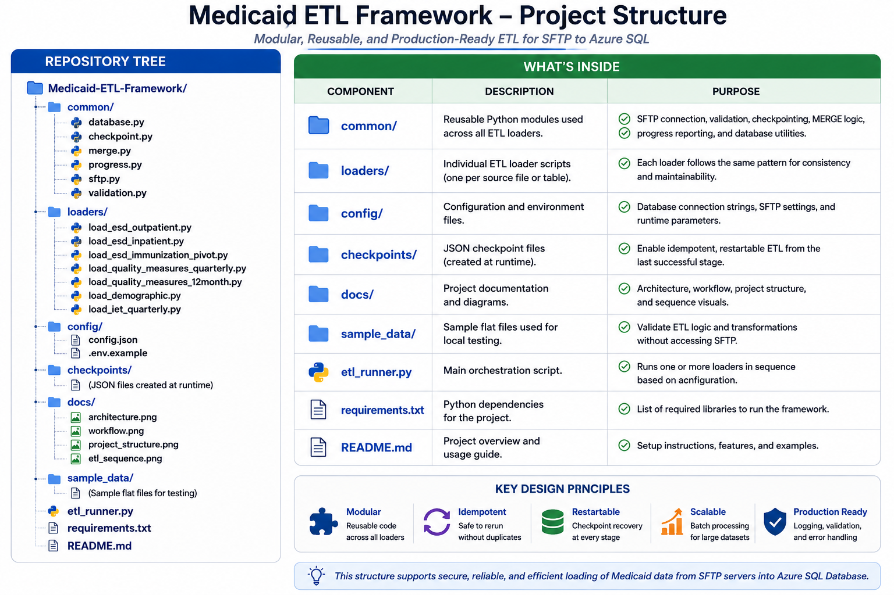
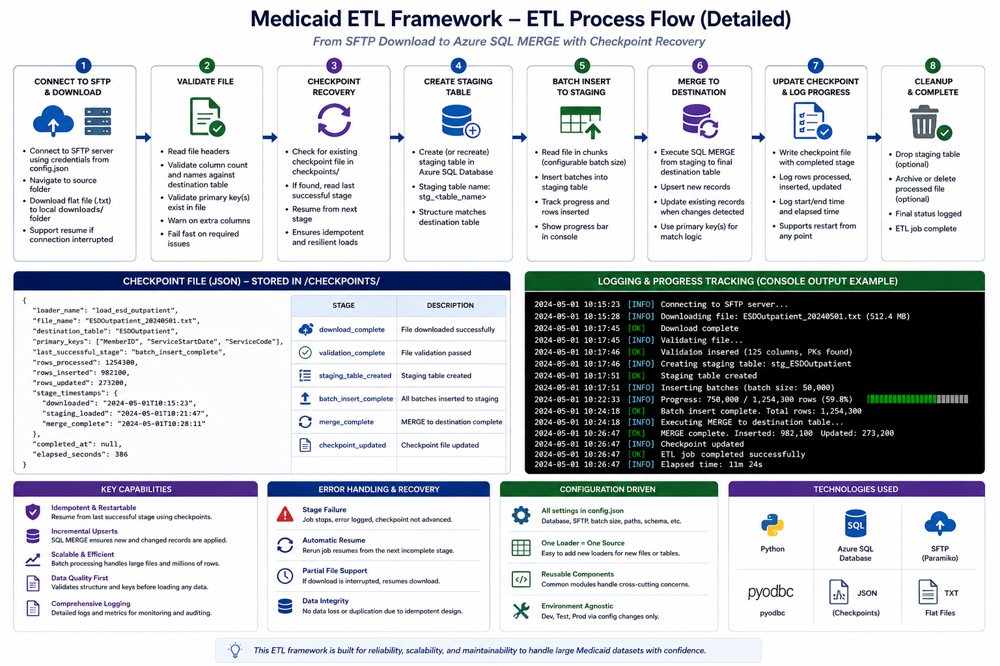
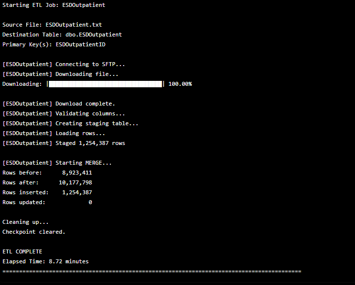

# Healthcare ETL Framework

## Overview

This repository demonstrates a production-style ETL framework built with Python for loading healthcare data from secure SFTP servers into Azure SQL Database.

The framework is designed to automate the ingestion of large healthcare datasets while providing resumable downloads, checkpoint recovery, batch processing, SQL staging tables, and MERGE-based updates.

This project is intended as a portfolio demonstration of ETL architecture, data engineering, and automation techniques.

## Architecture



## Workflow



## Project Structure



## ETL Sequence



## Script Ouput



---

## Features

* Secure SFTP file downloads
* Automatic resume of interrupted downloads
* Progress reporting during downloads and data loads
* Batch processing for large datasets
* Azure SQL staging tables
* SQL MERGE operations (insert/update)
* Duplicate prevention
* Checkpoint recovery
* Environment-based configuration
* Reusable ETL framework

---

## Technologies

* Python
* SQL Server / Azure SQL Database
* Paramiko
* pyodbc
* python-dotenv
* Git
* GitHub

---

## Repository Structure

```text
Healthcare-ETL-Framework/
│
├── loaders/
├── common/
├── config/
├── docs/
├── sample_data/
├── README.md
├── requirements.txt
└── .gitignore
```

---

## Included ETL Loaders

* Outpatient File
* Inpatient File
* Immunization Pivot File
* Quarterly Quality Measures File
* 12-Month Quality Measures File
* IET Quarterly File
* Demographic Data File

---

## Typical Workflow

```text
SFTP Server
      │
      ▼
Download File
      │
      ▼
Checkpoint Recovery
      │
      ▼
Data Validation
      │
      ▼
Batch Processing
      │
      ▼
SQL Staging Table
      │
      ▼
MERGE into Production Table
      │
      ▼
Completion Summary
```

---

## Disclaimer

This repository is provided for portfolio purposes and demonstrates general ETL architecture and engineering practices. It does not contain proprietary datasets, credentials, confidential business logic, or any protected information from a former employer.


[def]: docs/architecture.png